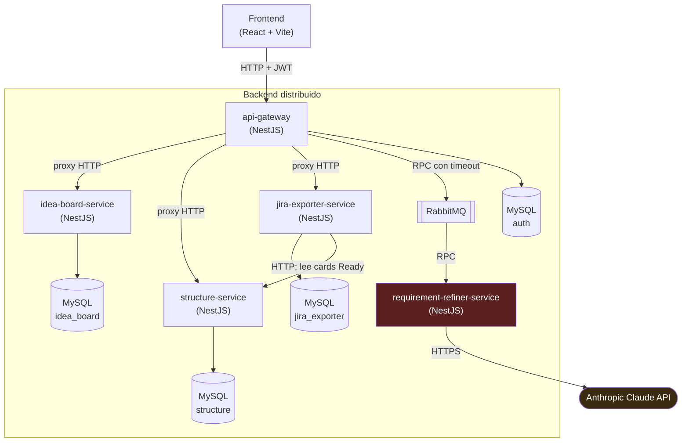

# Arquitectura de ClarityHub

Documento de referencia para explicar el diseño del backend distribuido en
la entrega del PTI. Ver también `DEMO.md` para la demostración práctica de
tolerancia a fallos, y el `README.md` de cada servicio bajo `backend/` para
el detalle de su API.

## Diagrama de componentes

`requirement-refiner-service` (rojo) es el único nodo que depende de un
proveedor externo. Está deliberadamente aislado detrás de RabbitMQ en vez
de expuesto directo por el gateway — ver la sección de tolerancia a fallos.

## Los 4 módulos funcionales y su servicio

| Módulo del brief         | Servicio                     | Responsabilidad                                                        |
|---------------------------|-------------------------------|--------------------------------------------------------------------------|
| Idea Board                 | `idea-board-service`          | CRUD de ideas y adjuntos. Sin dependencias externas.                     |
| Requirement Refiner        | `requirement-refiner-service` | Llama a Claude para resumir, generar NFRs/historias/criterios. Sin base de datos propia — es puro cómputo detrás de una cola. |
| Structure & Hierarchy      | `structure-service`           | Persiste épicas, historias, subtareas y NFRs con jerarquía coherente.    |
| Jira Exporter               | `jira-exporter-service`       | Genera el CSV de exportación a partir de lo ya estructurado, con reintentos. |

`api-gateway` no es uno de los 4 módulos — es la puerta de entrada única
para el frontend, sin lógica de negocio propia. Sí tiene una base de datos
propia (`auth`, ver más abajo): la tabla `users` que respalda el login.

## Por qué esta división (no un monolito)

Cada servicio tiene su propia base de datos MySQL (excepto
`requirement-refiner-service`, que no necesita ninguna) — no hay un
esquema compartido. Esto es intencional: si la base de datos de un
servicio se cae o se corrompe, ningún otro servicio se ve afectado, porque
ninguno lee ni escribe en una base que no es la suya.

La comunicación es mayormente HTTP síncrono con timeouts explícitos
(`ProxyService` en el gateway), excepto el camino hacia
`requirement-refiner-service`, que va por RabbitMQ — el único tramo donde
el brief exige desacople asíncrono, precisamente porque es el que depende
de un proveedor externo con rate limits y latencia variable.

## Cómo se cumple cada criterio de evaluación

**Código** — 4 servicios + gateway, cada uno un proyecto NestJS
independiente con su propio `package.json`, `Dockerfile` y suite de tests
e2e. Ninguna lógica de negocio (procesamiento de ideas, llamadas a IA,
generación de jerarquía, generación de CSV) vive en el frontend — ver
`App.tsx` (root) y compararlo con `services/apiClient.ts`: el frontend
sólo hace fetch/render.

**Infraestructura** — cada servicio tiene su propio `Dockerfile`
multi-stage; `docker-compose.yml` en la raíz orquesta los 5 servicios + 3
MySQL + RabbitMQ como contenedores independientes, cada uno con su
propio healthcheck. Ver `DEMO.md` para el procedimiento de apagar/prender
un contenedor puntual.

**Procesamiento almacenado** — ideas y adjuntos en `idea_board` (MySQL);
épicas, subtareas y NFRs con relaciones (`ProjectCard` 1—N `Subtask`) en
`structure`; historial de exportaciones (`ExportJob`, con su CSV generado y
mensaje de error si falló) en `jira_exporter`. Persistencia vía Prisma ORM
en los tres; el schema se aplica con `prisma db push` (equivalente al
`synchronize: true` de un ORM tradicional) para este alcance del PTI — ver
la nota en cada `README.md` de servicio sobre migrar a
`prisma migrate deploy` antes de un uso productivo real.

**Distribución / tolerancia a fallos** — ver `DEMO.md`: apagar
`requirement-refiner-service` dejando el resto operativo fue verificado en
vivo (navegador real vía Playwright) durante el desarrollo, no sólo
diseñado en el papel. `api-gateway` aplica timeout a cada proxy y a la
llamada RPC, así que un servicio caído nunca cuelga al gateway mismo —
sólo la ruta que depende de él responde con un error HTTP limpio (503/504).

## Autenticación / autorización

`api-gateway` expone `POST /auth/register` y `POST /auth/login` (tabla
`users` propia, contraseñas con `bcrypt`, sesión como JWT firmado con
`JWT_SECRET`). `JwtAuthGuard` está registrado como `APP_GUARD` global, así
que **toda ruta requiere `Authorization: Bearer <token>` salvo las
marcadas `@Public()`** (`/auth/register`, `/auth/login`, `/health*`) — ver
`src/auth/` y `app.module.ts`.

### Aislamiento por proyecto

Un usuario puede tener varios proyectos (un PM real suele trabajar más de
uno en simultáneo) y sólo ve los que él mismo creó. `api-gateway` tiene su
propia tabla `projects` (misma base `auth`, `ownerId` → `users.id`) con
`POST /projects` (crear) y `GET /projects` (listar los propios) —
`src/projects/`. El frontend guarda cuál es el proyecto activo
(`localStorage`, mismo patrón que el JWT) y muestra un selector/creador de
proyecto al loguearse (`ProjectPickerView` en `App.tsx`).

Cada fila de dominio (`Idea`, `Attachment`, `ProjectCard`, `Nfr`,
`ExportJob`) tiene su propia columna `project_id` en su base — no
`owner_id`: una vez que el gateway verificó que el proyecto pertenece al
usuario, los servicios de dominio no necesitan saber nada más sobre
usuarios, sólo sobre proyectos.

El mecanismo de propagación, en dos capas:

1. **Gateway → dominio**: `JwtAuthGuard` verifica el JWT; `ProjectGuard`
   (`src/projects/project.guard.ts`, aplicado a los proxy controllers de
   `/ideas`, `/attachments`, `/cards`, `/nfrs`, `/exports` — no global, para
   no exigirlo en `/projects` ni `/auth`) exige un header `X-Project-Id` del
   frontend y comprueba que ese proyecto sea del usuario autenticado
   (`ProjectsService.findOne`, 404 si no es suyo). Recién ahí
   `ProxyService.forward` reenvía ese id, ya verificado, al servicio de
   dominio correspondiente.
2. **Dentro de cada servicio de dominio**: su propio `ProjectGuard` (mismo
   nombre, implementación más simple — sólo exige el header, no lo
   revalida) filtra *toda* query por ese `projectId`, incluyendo lecturas
   por id (`findFirst` en vez de `findUnique`, para que un id ajeno dé 404
   en vez de 200). `jira-exporter-service` reenvía el mismo header cuando
   llama a `structure-service` para traer las cards `Ready` de ese
   proyecto — sin eso, exportar mezclaría cards de cualquier proyecto.

Esto depende de que ningún llamador salte al gateway: `idea-board-service`,
`structure-service` y `jira-exporter-service` siguen escuchando en sus
puertos directamente (ver `docker-compose.yml`, pensado para el demo de
tolerancia a fallos), así que su `ProjectGuard` **confía** en el header en
vez de volver a verificar nada — cualquiera con acceso directo a esos
puertos puede mandar cualquier `X-Project-Id` que quiera. Aceptable dentro
de una red docker-compose local para el alcance del PTI; en un despliegue
real esos puertos no deberían quedar expuestos fuera de la red interna.

## Seguridad de API

Cuatro puntos que suelen quedar afuera de un PTI y que se evaluaron
explícitamente:

- **CORS**: los 5 servicios restringen `enableCors` a los orígenes de
  `CORS_ORIGIN` (`src/cors.ts` en cada uno, coma-separado, default al
  dev server de Vite) en vez de aceptar cualquier origen. En la práctica
  el único que un navegador ejercita directo es `api-gateway` — los otros
  4 nunca tienen dominio público en Railway (ver `DEPLOY.md`) — pero
  queda igual de restringido por si alguna vez lo tienen.
- **Rate limiting**: `api-gateway` usa `@nestjs/throttler` (`ThrottlerGuard`
  como `APP_GUARD`, antes que `JwtAuthGuard` para no gastar verificación de
  JWT en un flood) con un default de 60 req/min/IP, y `/ai/*`
  (`AiController`) baja eso a 20 req/min/IP porque cada llamada ahí gasta
  cuota real de Anthropic — es la ruta donde un abuso cuesta plata, no sólo
  carga.
- **Tamaño de adjuntos**: `CreateAttachmentDto` (idea-board-service) limita
  el `base64` a 8MB decodificados (`MaxLength` calculado sobre la
  expansión ~4/3 de base64); `api-gateway` e `idea-board-service` también
  suben el límite del body parser JSON a 11MB (el default de Express es
  100kb) para que el límite real sea el de la validación explícita, no un
  413 genérico del parser.
- **Secrets en texto plano**: `ANTHROPIC_API_KEY` y `JWT_SECRET` viven como
  variables de entorno de Railway sin rotación ni vault. Aceptado
  deliberadamente para el alcance del PTI — no hay presupuesto ni
  necesidad de un secret manager para una entrega académica — pero es lo
  primero a resolver (Railway tiene integración con algún vault, o
  mínimamente rotación manual periódica) antes de un uso productivo real
  con datos de usuarios reales.

## Decisiones de diseño no explícitas en el brief

- **NFRs viven en `structure-service`**, no en un servicio propio: son un
  insumo chico y fuertemente acoplado a la jerarquía del backlog (la
  estimación y la generación de tarjetas los leen), sin ciclo de vida
  independiente — no justificaba una base de datos + servicio nuevos.
- **`jira-exporter-service` lee de `structure-service` por HTTP**, no
  recibe los datos ya armados del gateway: necesita siempre la última
  versión de las cards `Ready`, y consultarlas directamente evita que el
  gateway tenga que orquestar ese fetch en cada exportación.
- **Subtareas se manejan por `id` (UUID), no por índice de array**: el
  frontend original identificaba subtareas por posición en el array; al
  persistirlas server-side cada una tiene su propio id real, así que se
  ajustó el contrato (`types.ts` → `Subtask.id`) para que edición y borrado
  sean inequívocos incluso si el orden cambia.
