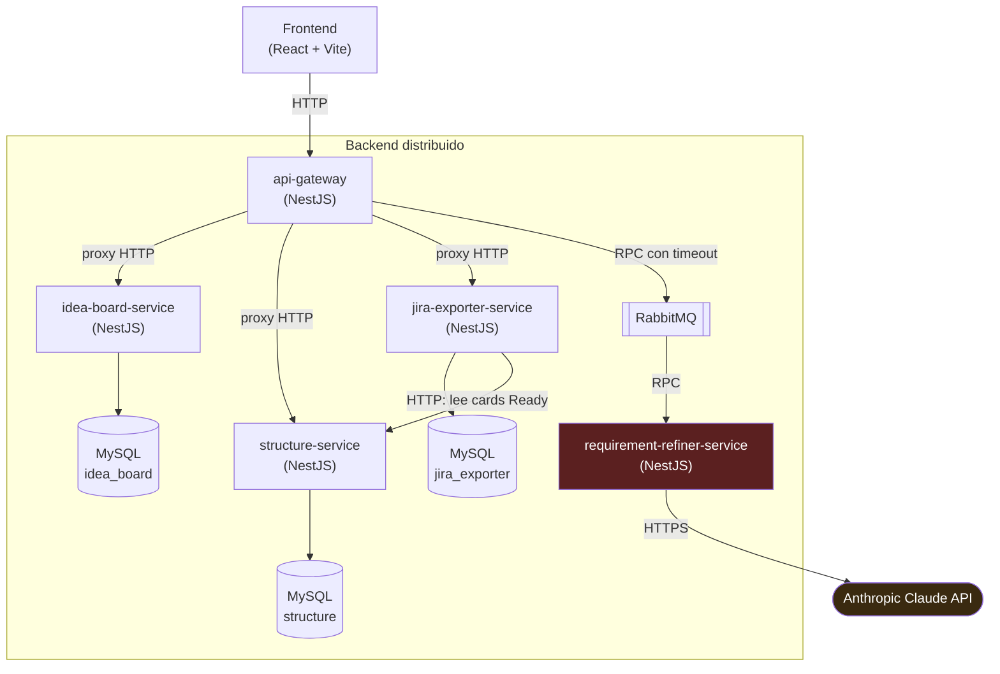

# Arquitectura de ClarityHub

Documento de referencia para explicar el diseño del backend distribuido en
la entrega del PTI. Ver también `DEMO.md` para la demostración práctica de
tolerancia a fallos, y el `README.md` de cada servicio bajo `backend/` para
el detalle de su API.

## Diagrama de componentes

`requirement-refiner-service` (rojo) es el único nodo que depende de un
proveedor externo. Está deliberadamente aislado detrás de RabbitMQ en vez
de expuesto directo por el gateway — ver la sección de tolerancia a fallos.

## Los 4 módulos funcionales y su servicio

| Módulo del brief         | Servicio                     | Responsabilidad                                                        |
|---------------------------|-------------------------------|--------------------------------------------------------------------------|
| Idea Board                 | `idea-board-service`          | CRUD de ideas y adjuntos. Sin dependencias externas.                     |
| Requirement Refiner        | `requirement-refiner-service` | Llama a Claude para resumir, generar NFRs/historias/criterios. Sin base de datos propia — es puro cómputo detrás de una cola. |
| Structure & Hierarchy      | `structure-service`           | Persiste épicas, historias, subtareas y NFRs con jerarquía coherente.    |
| Jira Exporter               | `jira-exporter-service`       | Genera el CSV de exportación a partir de lo ya estructurado, con reintentos. |

`api-gateway` no es uno de los 4 módulos — es la puerta de entrada única
para el frontend, sin lógica de negocio ni base de datos propia.

## Por qué esta división (no un monolito)

Cada servicio tiene su propia base de datos MySQL (excepto
`requirement-refiner-service`, que no necesita ninguna) — no hay un
esquema compartido. Esto es intencional: si la base de datos de un
servicio se cae o se corrompe, ningún otro servicio se ve afectado, porque
ninguno lee ni escribe en una base que no es la suya.

La comunicación es mayormente HTTP síncrono con timeouts explícitos
(`ProxyService` en el gateway), excepto el camino hacia
`requirement-refiner-service`, que va por RabbitMQ — el único tramo donde
el brief exige desacople asíncrono, precisamente porque es el que depende
de un proveedor externo con rate limits y latencia variable.

## Cómo se cumple cada criterio de evaluación

**Código** — 4 servicios + gateway, cada uno un proyecto NestJS
independiente con su propio `package.json`, `Dockerfile` y suite de tests
e2e. Ninguna lógica de negocio (procesamiento de ideas, llamadas a IA,
generación de jerarquía, generación de CSV) vive en el frontend — ver
`App.tsx` (root) y compararlo con `services/apiClient.ts`: el frontend
sólo hace fetch/render.

**Infraestructura** — cada servicio tiene su propio `Dockerfile`
multi-stage; `docker-compose.yml` en la raíz orquesta los 5 servicios + 3
MySQL + RabbitMQ como contenedores independientes, cada uno con su
propio healthcheck. Ver `DEMO.md` para el procedimiento de apagar/prender
un contenedor puntual.

**Procesamiento almacenado** — ideas y adjuntos en `idea_board` (MySQL);
épicas, subtareas y NFRs con relaciones (`ProjectCard` 1—N `Subtask`) en
`structure`; historial de exportaciones (`ExportJob`, con su CSV generado y
mensaje de error si falló) en `jira_exporter`. Persistencia vía Prisma ORM
en los tres; el schema se aplica con `prisma db push` (equivalente al
`synchronize: true` de un ORM tradicional) para este alcance del PTI — ver
la nota en cada `README.md` de servicio sobre migrar a
`prisma migrate deploy` antes de un uso productivo real.

**Distribución / tolerancia a fallos** — ver `DEMO.md`: apagar
`requirement-refiner-service` dejando el resto operativo fue verificado en
vivo (navegador real vía Playwright) durante el desarrollo, no sólo
diseñado en el papel. `api-gateway` aplica timeout a cada proxy y a la
llamada RPC, así que un servicio caído nunca cuelga al gateway mismo —
sólo la ruta que depende de él responde con un error HTTP limpio (503/504).

## Decisiones de diseño no explícitas en el brief

- **NFRs viven en `structure-service`**, no en un servicio propio: son un
  insumo chico y fuertemente acoplado a la jerarquía del backlog (la
  estimación y la generación de tarjetas los leen), sin ciclo de vida
  independiente — no justificaba una base de datos + servicio nuevos.
- **`jira-exporter-service` lee de `structure-service` por HTTP**, no
  recibe los datos ya armados del gateway: necesita siempre la última
  versión de las cards `Ready`, y consultarlas directamente evita que el
  gateway tenga que orquestar ese fetch en cada exportación.
- **Subtareas se manejan por `id` (UUID), no por índice de array**: el
  frontend original identificaba subtareas por posición en el array; al
  persistirlas server-side cada una tiene su propio id real, así que se
  ajustó el contrato (`types.ts` → `Subtask.id`) para que edición y borrado
  sean inequívocos incluso si el orden cambia.
